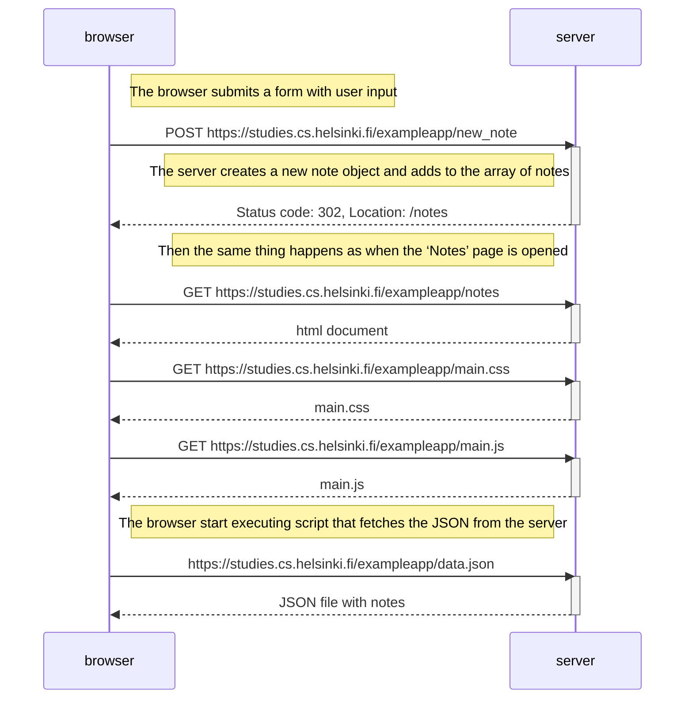

```mermaid
sequenceDiagram
    participant browser
    participant server

    Note right of browser: The browser submits a form with user input
    browser ->> server: POST https://studies.cs.helsinki.fi/exampleapp/new_note
    activate server
    Note left of server: The server creates a new note object and adds to the array of notes
    server -->> browser: Status code: 302, Location: /notes
    deactivate server

    Note left of server: Then the same thing happens as when the ‘Notes’ page is opened

    browser ->> server: GET https://studies.cs.helsinki.fi/exampleapp/notes
    activate server
    server -->> browser: html document
    deactivate server

    browser ->> server: GET https://studies.cs.helsinki.fi/exampleapp/main.css
    activate server
    server -->> browser: main.css
    deactivate server

    browser ->> server: GET https://studies.cs.helsinki.fi/exampleapp/main.js
    activate server
    server -->> browser: main.js
    deactivate server

    Note right of browser: The browser start executing script that fetches the JSON from the server

    browser ->> server: https://studies.cs.helsinki.fi/exampleapp/data.json
    activate server
    server -->> browser: JSON file with notes
    deactivate server
```
