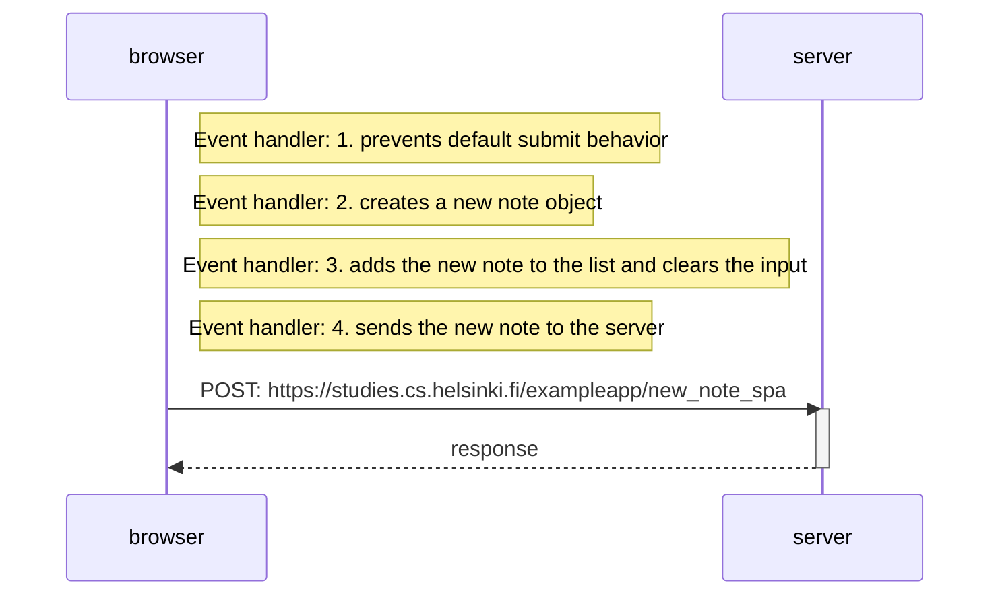

```mermaid
sequenceDiagram
    participant browser
    participant server

    Note right of browser: Event handler: 1. prevents default submit behavior
    Note right of browser: Event handler: 2. creates a new note object
    Note right of browser: Event handler: 3. adds the new note to the list and clears the input
    Note right of browser: Event handler: 4. sends the new note to the server

    browser ->> server: POST: https://studies.cs.helsinki.fi/exampleapp/new_note_spa
    activate server
    server -->> browser: response
    deactivate server
```
