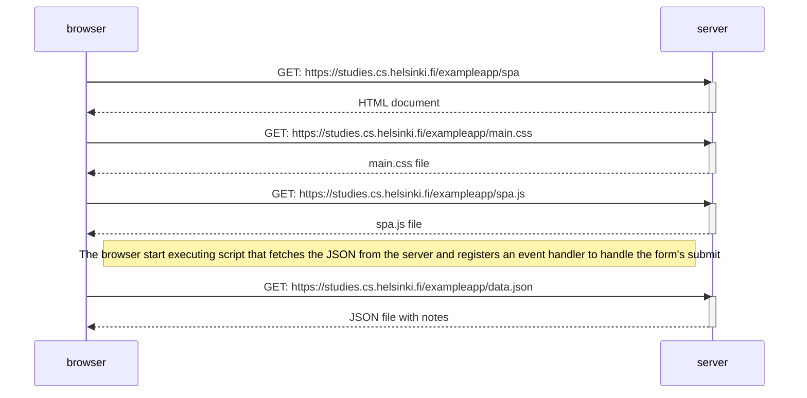

```mermaid
sequenceDiagram
    participant browser
    participant server

    browser ->> server: GET: https://studies.cs.helsinki.fi/exampleapp/spa
    activate server
    server -->> browser: HTML document
    deactivate server

    browser ->> server: GET: https://studies.cs.helsinki.fi/exampleapp/main.css
    activate server
    server -->> browser: main.css file
    deactivate server

    browser ->> server: GET: https://studies.cs.helsinki.fi/exampleapp/spa.js
    activate server
    server -->> browser: spa.js file
    deactivate server

    Note right of browser: The browser start executing script that fetches the JSON from the server and registers an event handler to handle the form's submit
    browser ->> server: GET: https://studies.cs.helsinki.fi/exampleapp/data.json
    activate server
    server -->> browser: JSON file with notes
    deactivate server
```
